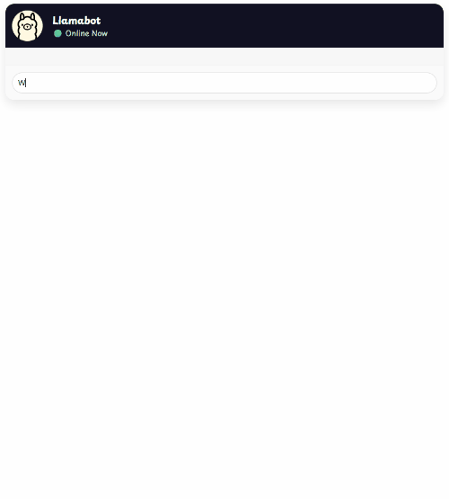

# Chat Retrieval Augmented Generation

This module demonstrates how to create a streaming chatbot application with retrieval-augmented generation (RAG) capabilities, using the Simpsons TV show as an example..
It covers the following:

- How to use the `ChatClient` API to interact with an LLM and stream responses.
- How to connect to a vector database, store embeddings, and perform similarity searches.
- How to tune the RAG process using a custom prompt template.

It leverages the following AI technologies:

- Chat model: `gemma3:4b`
- Embedding model: `qwen3-embedding:0.6b`
- Vector database: PGVector



## Prerequisites

To compile and run this demo, you’ll need:

- Java 21
- Maven
- Node.js 24
- NPM
- Ollama
- Docker

## Running the Application

To run the application manually:

- Start Ollama.
- Start a PGVector database in Docker using:

```bash
docker run -d -e POSTGRES_USER=postgres -e POSTGRES_PASSWORD=changeme -p 5432:5432 pgvector/pgvector:pg18
```

- Start the back-end server.
- Start the front-end UI using `ng serve` from the `ui` directory.

Alternatively, to run everything at once using Docker, run:

```bash
docker-compose up -d
```

This will start the following services in Docker:

- Ollama
- PGVector database
- Chat Retrieval Augmented Generation application (available at http://localhost:8080)
