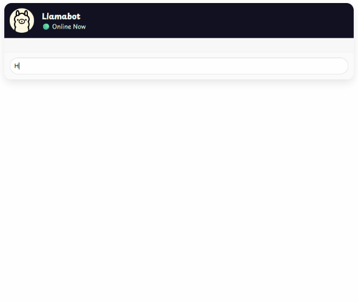

# Chat Stream

This module demonstrates how to create a streaming chatbot application.
It demonstrates the following:

- How to use the ChatClient API to interact with an LLM model and stream responses.



## Prerequisites

To compile and run this demo, you’ll need:

- Java 21
- Maven
- Node.js 24
- Docker

## Running the Application

To run the application manually:

- Start [Ollama](https://ollama.com/).
- Start the back-end server.
- Start the front-end UI using `ng serve` from the `ui` directory.

Alternatively, to run the application with Docker, use the following command:

```console
docker-compose up -d
```

This will start the following services in Docker:

- Ollama
- Open WebUI (available at http://localhost:3000)
- Chat Stream application (available at http://localhost:8080)
